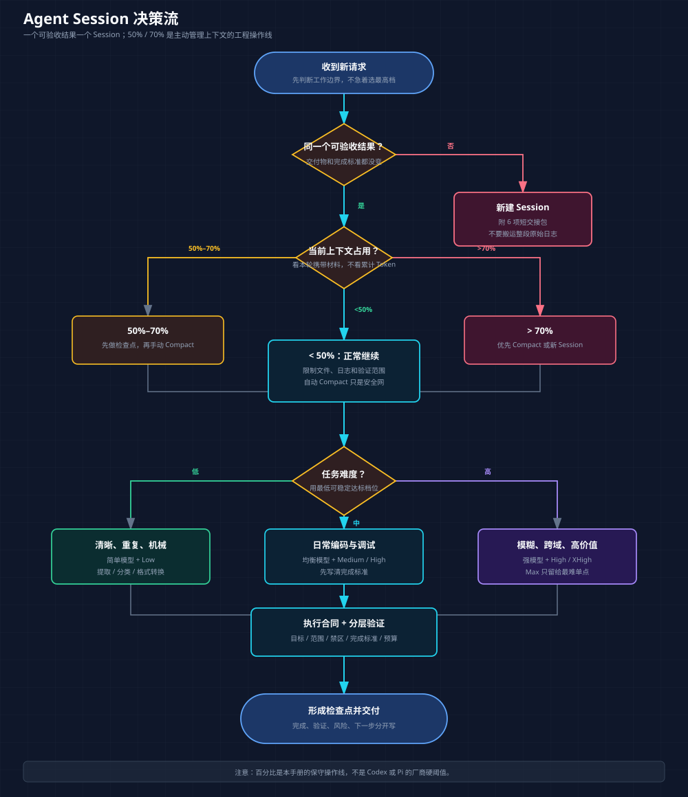
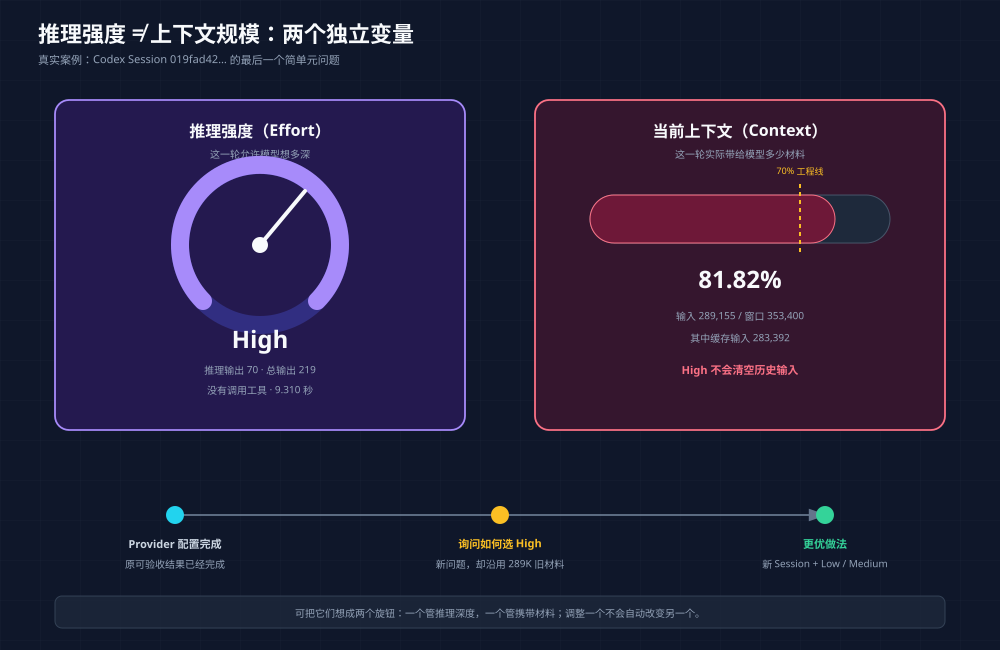

# Codex Session、模型与上下文高效使用手册

> 目标：基于 954 个历史 Codex Session、官方 Codex 手册和真实反例，把“会用 Codex”变成一套可观测、可复核、可改进的方法。
>
> Pi Agent 的对应手册：[Pi Agent + 模型高效使用手册](./pi-agent-model-usage.zh-CN.md)

## 0. 一页结论

1. **一个项目可以有很多 Session；一个 Session 只服务一个“可验收结果”。** 它指这次会话最终要交付、并且能判断是否完成的一件事。
2. **先选任务边界，再选模型和 Reasoning。** 边界错了，换更聪明的模型只会更昂贵地处理噪声。
3. **推理强度与上下文规模是两个独立变量。** 前者决定“这一轮要想多深”，后者决定“这一轮带多少材料”；`high/xhigh` 不会清空 289K 历史输入。
4. **缓存不会释放上下文窗口。** 95% Cached 仍可能处在 90% 窗口压力下。
5. **Compact 会丢细节。** 可验收结果已经变化时，优先新建 Session；必须连续时才先交接、再 Compact。
6. **“继续”必须附恢复点和停止条件。** 网络中断后只说“继续完成”，可能触发大范围重复探索。
7. **High 及以上不是默认档。** 本次审计 80.35% 的唯一 Turn 使用 High 及以上，明显缺少分层。



## 阅读前先懂两个核心概念

### 什么是“可验收结果”（Outcome）

一句话定义：

> **可验收结果 = 明确交付物 + 完成标准 + 工作边界。**

它不是“项目名”，也不是“继续、看看、优化、部署”这种动作。它是这次 Session 结束时，你能拿出来检查，并回答“完成了没有”的一件事。

例如：

| 你的说法 | 是不是可验收结果 | 原因与更好的写法 |
|---|---|---|
| “你看看这个项目” | 不是 | 没有交付物和完成标准。改成：“输出项目架构概览、模块职责和 5 个关键入口，并引用源码文件。” |
| “继续完成” | 不是 | 只说明动作，没有说明从哪里恢复、还剩什么。应补充已完成项、恢复点和停止条件。 |
| “修复 PWA 登录过期后显示 401” | 还不完整 | 有目标但没有验收。改成：“过期后跳转登录页，相关认证测试通过，不改变本地开发行为。” |
| “修复 PWA 401，并让认证回归测试通过” | 是 | 有行为结果、有测试证据、边界清楚。 |
| “部署吧” | 不是 | 没有环境、版本、健康检查和回滚条件。 |
| “把 commit X 部署到生产，健康检查通过，并准备可执行回滚命令” | 是 | 交付物和验收条件都明确。 |

一个可验收结果可以包含多个步骤：调查 → 修改 → 定向测试 → 总结。这些步骤仍可留在同一 Session，因为它们共同证明同一个结果。

一旦交付物或验收标准变化，就通常是新的可验收结果。例如：

```text
修复 PWA 401          ← 一个可验收结果
把修复部署到生产      ← 新的可验收结果
把过程写成新手教程    ← 又一个可验收结果
```

判断时问三个问题：

1. Session 结束时具体交付什么？
2. 用什么客观证据判断完成？
3. 新请求是否仍需要当前历史的大部分细节？

前两题答不出来，说明目标还太模糊；第三题回答“否”，通常应该新建 Session。

### 什么是“推理强度”和“上下文”

可以把 Agent 想成一位坐在桌前的工程师：

| 概念 | 大白话 | 类比 |
|---|---|---|
| 模型 | Agent 本身的能力水平 | 换一位能力不同的工程师 |
| 推理强度（Effort） | 允许模型在这一轮投入多少推理深度 | 让工程师快速判断，还是花更多时间认真推演 |
| 当前上下文（Context） | 这一轮发送给模型的全部材料 | 工程师桌面上摊开的需求、聊天、代码、日志和工具结果 |
| 上下文窗口 | 模型一次最多能接收多少材料 | 桌面最多能放多少资料 |
| 累计 Token | 整个 Session 每轮重复处理量的总和 | 工程师多次翻阅资料的累计页数 |

“两个旋钮”只是比喻，真正含义是：**推理强度和当前上下文必须分别管理，调整一个不会自动改变另一个。**

```text
提高推理强度：模型这一轮可能想得更深，但旧聊天、日志和文件不会消失。
减少当前上下文：模型要阅读的历史变少，但模型本身不会因此自动变聪明。
```

因此，`High + 300K 历史`、`Low + 300K 历史`、`High + 20K 历史`是三种完全不同的运行状态。

## 1. 官方理论：Codex 希望你怎样使用它

本节依据 2026-07-29 获取的官方 Codex 手册快照。模型名和产品入口会变化，原则比具体名称更稳定。

### 1.1 好 Prompt 的四个字段

官方最佳实践建议给出：

| 字段 | 你要回答的问题 |
|---|---|
| 目标（Goal） | 最终要改变、构建或判断什么？ |
| 相关材料（Context） | 哪些文件、文档、错误、截图或事实相关？只提供真正需要的材料。 |
| 约束（Constraints） | 范围、禁区、安全、架构和权限限制是什么？ |
| 完成标准（Done when） | 什么客观证据表示任务完成？ |

这四项能减少 Agent 猜测、无边界搜索和过度验证。来源：[Codex Best practices](https://learn.chatgpt.com/guides/best-practices)。

### 1.2 一个 Chat 对应一个可验收结果

官方建议一个 Chat 对应一个连贯工作单元。这里把它翻译成更容易操作的“一个可验收结果”：围绕一个交付物和一组完成标准开展的连续工作。把整个项目长期塞进一个 Chat，会导致上下文膨胀和结果逐渐变差。

下面三个请求虽然属于同一个项目，但交付物和验收标准不同：

- “修复 PWA 401 并通过认证回归测试”是一个可验收结果；
- “把已验证的修复部署到服务器并通过健康检查”是另一个可验收结果；
- “研究模型配置并输出待决策表”是另一个可验收结果；
- “把这次经历整理成使用手册”又是另一个可验收结果。

这些工作可以互相交接，但不必共享完整历史。

### 1.3 官方模型角色

2026-07-29 的官方手册将 GPT-5.6 系列描述为：

| 模型 | 官方定位 | 推荐任务 |
|---|---|---|
| Sol | 复杂、开放、高价值、需要判断和润色 | 深度研究、复杂实现、重要设计与文档 |
| Terra | 日常工作主力，兼顾推理和工具 | 常规编码、扫描、调试、一般审查 |
| Luna | 清晰、重复、高吞吐 | 提取、分类、转换、结构化摘要 |

默认 Power 使用 `gpt-5.6-sol + medium`；官方建议从默认推理强度开始，需要更深规划或分析时再提高。来源：[Codex Models](https://learn.chatgpt.com/docs/models)。

### 1.4 推理强度（Reasoning Effort）档位

| 档位 | 适用场景 |
|---|---|
| Light / Low | 快速、清晰、范围固定 |
| Medium | 需要一定规划的日常任务 |
| High / Extra High | 困难、多步骤、多来源、多权衡 |
| Max | 最难的单个问题，深度比时间和用量重要 |
| Ultra | 可并行拆分的大任务；会使用子代理，Token 消耗更高 |

原则是：**使用能稳定达标的最低档位**，不是永远选择最高档。

### 1.5 New、Fork 与 Compact

| 动作 | 何时用 | 结果 |
|---|---|---|
| New Session | 新的可验收结果、旧历史大多无关 | 全新上下文，带短交接 |
| Fork | 真正要探索两个分支 | 保留原路径，创建独立分支 |
| Compact | 可验收结果不变，但历史过长 | 用摘要替代早期历史，有损 |

Codex 会自动 Compact，也支持手动 Compact。CLI 可以用 `/status` 看模型、Token 和环境，用 `/compact`、`/new`、`/fork` 管理会话；桌面 App 使用对应的模型、Reasoning、新 Chat 与会话控件。来源：[Codex CLI slash commands](https://learn.chatgpt.com/docs/developer-commands?surface=cli)。

## 2. 审计范围与正确统计口径

### 2.1 固定快照

为避免当前审计任务污染数据，固定 cutoff：

```text
2026-07-29T11:05:23Z
```

排除当前主任务及其审计子任务。cutoff 前：

| 指标 | 数值 |
|---|---:|
| Session JSONL | 954 |
| 现代格式 / 旧格式 | 952 / 2 |
| 2026-07 Session | 227 |
| 物理总大小 | 5,454,687,210 B = 5.45 GB（5.08 GiB） |
| 文件中位数 | 377,199 B |
| 文件 P90 | 6,923,331 B |

### 2.2 为什么不能直接数 JSONL 行

子代理、恢复或 Fork 可能重放父历史。同一个 task、tool call 或 compaction 会在多个文件出现。

因此必须区分：

| 对象 | 原始出现 | 更可信的唯一口径 |
|---|---:|---:|
| Task started | 9,745 | 7,389 个唯一 `turn_id` |
| Task complete | 9,246 | 7,084 个唯一 `turn_id` |
| Turn aborted | 455 | 294 个唯一 `turn_id` |
| Tool call | 167,940 | 158,951 个唯一 `call_id/id` |
| Compaction | 1,582 | 1,365 个唯一 `window_id` |

`user_message` 原始出现 10,642 次，但只有 7,164 条可关联唯一 Turn；另有旧格式或重放消息，不能武断称为“唯一人类消息”。

### 2.3 时间数据

| 指标 | 唯一配对结果 |
|---|---:|
| Task 总活跃时间 | 708.63 小时 |
| Task 中位数 | 100.517 秒 |
| Task P90 | 787.012 秒（13.12 分钟） |
| Tool 总配对时间 | 98.89 小时 |
| Tool 中位数 | 174 ms |
| Tool P90 | 3.627 秒 |

这不是“用户总等待时间”：任务可并行，子代理也会重叠。它适合描述工作量，不适合简单相加成日历时间。

## 3. Token、上下文、缓存和推理 Token

先回忆前面的定义：当前上下文是“这一轮发送给模型的全部材料”，不只是你刚输入的那句话。它通常还包括系统指令、`AGENTS.md`、保留的聊天历史、Compact 摘要、工具定义、工具结果以及本轮引用的文件内容。

### 3.1 `last_token_usage`

最近一次模型调用的近似结构：

```text
input_tokens
├── cached_input_tokens（input 的子集）
└── 非缓存 input

output_tokens
└── reasoning_output_tokens（output 的子集）
```

所以：

- 不要把 `cached_input_tokens` 再加到 `input_tokens`；
- 不要把 `reasoning_output_tokens` 再加到 `output_tokens`；
- 窗口压力近似看 `last.input_tokens / model_context_window`；
- Cached Input 仍占上下文窗口。

### 3.2 `total_token_usage`

这是当前 Session 的累计快照，不是本轮用量。相邻快照相减，才可近似得到一个 Task 的累计增量；遇到模型/provider reset 要分段。

同一条 `last_token_usage` 可能重复发射，不能逐条相加。全量审计只能取每个文件末条累计快照。

### 3.3 全量 Token 上界

831 个含 Token 记录的 Session，其末条累计快照逐文件相加：

| 字段 | 上界 |
|---|---:|
| input | 23,238,954,127 |
| cached input | 22,137,499,339 |
| output | 87,996,618 |
| reasoning output | 21,659,911 |
| total | 23,326,950,745 |
| 表观缓存率 | 95.26% |

这是存储审计上界，不是精确账单：子代理继承和历史重放会重复计算父历史。

### 3.4 高缓存率为什么仍可能浪费

缓存主要复用前缀。它不代表：

- 免费；
- 不占上下文；
- 没有网络或服务端处理；
- Agent 能从 300K 历史中更容易找到关键信息；
- 可以无限延长 Session。

## 4. 你的推理强度使用分布

按唯一 `turn_context` 统计：

| 推理强度 | Turn | 占比 |
|---|---:|---:|
| low | 719 | 9.8% |
| medium | 725 | 9.9% |
| high | 3,342 | 45.5% |
| xhigh | 2,205 | 30.0% |
| ultra | 305 | 4.1% |
| max | 56 | 0.8% |
| none | 1 | <0.1% |

**High 及以上占 80.35%。** 这不证明每次都错，但证明目前没有形成足够的难度分层。

建议默认路线：

```text
清晰抽取 / 查状态 / 机械修改 → Luna/Terra + Low
日常编码 / 一般调试         → Terra/Sol + Medium
复杂跨模块 / 架构 / 高风险   → Sol + High
极难单点                   → Sol + XHigh/Max，并写明理由
可并行、收益明确的大任务     → Ultra；否则单代理更省 Token
```

## 5. 主动上下文管理

| 窗口占用 | 操作 |
|---:|---|
| `<50%` | 正常推进，但继续限制日志、图片、文件和验证范围 |
| `50%–70%` | 完成小检查点，准备交接或 Compact |
| `>70%` | 优先新 Session；必须连续才 Compact |
| `>85%` | 只做收口，不扩大范围、不导入大文件 |

这些是本手册的工程操作线，不是 OpenAI 的硬触发阈值。

### 5.1 Compact 前的正确动作

```text
请先输出 Compact 检查点：
1. 目标与 Done when；
2. 已完成及证据；
3. 已修改文件；
4. 已验证 / 未验证；
5. 关键决定与理由；
6. 下一步与禁区。
输出后再 Compact，不要重跑工具。
```

### 5.2 优先新 Session 的判断

满足任意两项，通常直接新建：

- 新 Prompt 不需要旧 Session 的大部分细节；
- Done when 已改变；
- 从实现切换到部署、研究、文档或运营；
- 需要换模型或 Reasoning；
- 当前已超过 70%；
- 你开始频繁用“顺便”“接下来再”“另外还有”。

## 6. 真实案例分析

下列指标来自 JSONL；“应该怎样改”是基于事实的工程推导。案例做了匿名化，不复制完整 Prompt、账号或密码。

### 案例 1：把整个项目当成一个万能 Session

Session：`019f840a-3141-7611-b279-102b4f0a0e6c`

匿名任务：聊天系统仓库的连续开发，先后处理请求拦截、人工确认、provider 配置、HITL、证据链、移动端、视觉设计和自举开发等多个可验收结果。

| 指标 | 数值 |
|---|---:|
| 文件大小 | **731,427,203 B** |
| Task | 171（165 complete / 6 abort） |
| Tool call | 12,141 |
| Compaction | 162 |
| 日历跨度 / Task 活跃时间 | 118.35h / 60.91h |
| 末条累计 total | **1,937,476,010** |
| 其中 cached input | 1,862,780,160 |
| 最大窗口占用 | 96.52% |
| XHigh / Max 使用记录 | 287 / 38 |

额外证据：

- 17 条消息精确为“继续”或“继续完成”；
- Compaction 记录占文件 44.21%；
- Tool output 占文件 21.75%；
- 单条命令输出达到 4,556,356 B；
- 最后一条消息终于开始询问 Session 是否太大。

推导：

1. 162 次 Compact 没能修复根本边界问题，因为多个可验收结果仍在同一历史里滚动。
2. “一个项目一个 Session”应改为“一个可验收结果一个 Session”。
3. Provider 配置、架构、UI、移动端、HITL 等里程碑应分别交接。
4. 命令只返回摘要、错误尾部和产物路径；大日志和图片不应反复进入主历史。

无法从日志精确计算“如果早拆分能省多少”，所以不编造节省比例。

### 案例 2：Pi Web 长线混合远程、PWA、UI、认证和模型配置

Session：`019fa39b-bacc-7361-ab8c-ed8c87ad05b8`

| 指标 | 数值 |
|---|---:|
| 文件大小 | 30,508,741 B |
| Task | 17（15 complete / 2 abort） |
| Tool call | 671 |
| Compaction | 4 |
| Task 活跃时间 | 6.60h |
| 末条累计 total | 108,500,673 |
| 表观缓存率 | 96.07% |
| 最大窗口占用 | **91.58%** |
| 首次 Compact | 86.97% |
| 推理强度 | 16 条 XHigh + 5 条 High 记录 |

事实：主题从远程访问 → 手机同频 → PWA → 移动布局/图片 → 认证 → 模型配置，明显跨越多个可验收结果。

推导：至少拆为：

1. 连通性与部署；
2. PWA 与认证；
3. 移动 UI；
4. 模型配置。

96% Cached 没有消除 92% 窗口压力。每个 Session 结束时应输出 Commit/Diff、验证、风险和下一步交接。

### 案例 3：网络中断后反复“继续”，把模糊状态带进 XHigh

Session：`019fac8e-bf8f-7522-86a5-d1081c4e157d`

匿名任务：PWA 故障修复与部署。

| 指标 | 数值 |
|---|---:|
| Task | 9（8 complete / 1 abort） |
| Tool call | 143 |
| Compaction | 1 |
| 推理强度 | 首轮 High，后续 8 轮 XHigh |
| 末条累计 total | 27,011,706 |
| 最大窗口占用 | 84.48% |

关键子任务：

| Prompt 类型 | 耗时 | Tool call | Token 增量 / 峰值 |
|---|---:|---:|---:|
| 仅“继续完成” | 33m29.745s | 80 | 约 17,306,017；峰值 76.30% |
| 仅“部署吧” | 9m03.697s | 24 | 约 6,898,826；在 84.48% 才 Compact |
| 凭据标识输入错误后重试 | 先 abort，后 5m23.900s | 14 | 重试约 804,769 |

事实：短 Prompt 继承了庞大且状态不明确的历史；网络中断后的恢复轮做了大量工作。这里不展示任何账号或密码。

推导：问题不在“继续”两个字本身，而在缺少恢复点、剩余范围和停止条件。改成：

```text
继续完成 <单一可验收结果>。
已完成 A、B；从 C 恢复；只做 D、E。
先检查现有状态，不重复探索。
通过 X、Y 验收后停止并汇报。
```

部署前先做 checklist；凭据从安全配置读取，不在 Prompt 重输。

### 案例 4：一句简单元问题仍用 High，真正负担是 289K 历史

Session：`019fad42-83cb-76b2-9091-b7a1c1425806`

匿名任务：先做服务文档和模型配置，后来转为 Session 诊断与使用手册讨论。

| 指标 | 数值 |
|---|---:|
| Task | 11（10 complete / 1 abort） |
| Tool call | 91 |
| Compaction | 0 |
| 末条累计 total | 17,128,267 |
| 表观缓存率 | 97.37% |
| 最大窗口占用 | **81.82%** |
| 推理强度 | 前 3 轮 Low，后 8 轮 High |

最后一条只是询问“是否仍该选 High”：

| 字段 | 数值 |
|---|---:|
| 推理强度 | High |
| Tool | 0 |
| 耗时 | 9.310s |
| 单次 input / cached | 289,155 / 283,392 |
| output / reasoning | 219 / 70 |

逐步解释：

1. 用户这一轮的问题很短，但模型请求仍带入了 289,155 个 Input Token，因为旧聊天和工具结果还在当前上下文中。
2. 其中 283,392 个是缓存输入。缓存减少重复前缀的处理开销，但这些 Token 仍占上下文窗口。
3. 这一轮选择了 High，但最终记录的 Reasoning Output 只有 70 个 Token。High 表示允许模型投入更深推理，不保证每轮一定产生很多推理 Token。
4. 因此，这轮真正显眼的问题不是“模型没想够”，而是一个简单新问题仍携带了 81.82% 窗口的旧材料。

最简记法：

```text
推理强度（Effort） = 这一轮允许模型想多深
当前上下文（Context） = 这一轮实际带给模型多少材料
```



High 没有消除 289K 输入。Provider 配置已经完成，讨论“如何使用模型”属于新的可验收结果；更好的做法是新建 Session，再用 Low 或 Medium 提问。

### 案例 5：只想查文档，却触发了副作用方向

同一 Session `019fad42…` 的第 3 个 Task：用户给出 provider 文档 URL，要求获取模型与配置参数；任务使用 Low，40.382 秒、3 个工具、约 223,571 Token 后被 abort。下一条消息明确纠正：不要重新创建 Key，只按文档查模型与参数。

事实：目标发生了误解并被中断。

责任边界：Agent 本应先做只读检查，不能把责任全归用户。但用户可以用防副作用合同显著降低概率：

```text
只读官方文档；不要创建、轮换或写入 Key，不修改配置。
先列模型、参数、证据链接和待决策项，等我确认后再改。
```

## 7. 常见错误 → 具体后果 → 修正动作

| 使用错误 | 真实后果 | 修正 |
|---|---|---|
| 一个项目长期一个 Session | 731 MB 文件、162 次 Compact、近 1.94B 累计 Token | 一个可验收结果一个 Session |
| 只说“继续完成” | 状态模糊、重复探索、33 分钟与 80 次调用 | 附恢复点、剩余范围、停止条件 |
| 简单问题仍 High/XHigh | Reasoning 可能不高，但仍携带巨大历史 | 新 Session + Low/Medium |
| 90% Cached 就放心继续 | Cached 仍占窗口，案例峰值 91%–96% | 看窗口占用，不只看缓存率 |
| 等自动 Compact | 首次 Compact 常已到 84%–93% | 50%–70% 主动检查点 |
| 可验收结果变化后仍只做 Compact | 摘要继续携带不相关决定 | 交付物或完成标准变化时直接新建 Session |
| 大日志全部回传 | 单条命令输出达 4.56 MB | 过滤、截尾、写产物文件 |
| 不写 Done when | Agent 扩大搜索和验证 | 给行为、测试和停止条件 |
| 调研 Prompt 未禁止写操作 | Agent 可能走向认证或配置修改 | 明确“只读、无副作用、先汇报” |
| Prompt 粘贴密码/Token | 永久进入 JSONL、缓存和导出链路 | 安全配置 + 轮换已暴露凭据 |

## 8. 可直接复制的 Prompt 模板

### 8.1 简单事实任务

```text
只读回答，不修改文件。
目标：从 <文件/目录> 提取 <固定字段>。
只输出 <格式>；不扩展调研，不运行测试。
Done when：字段齐全，并标明来源文件。
建议：使用快速模型 + Low。
```

### 8.2 复杂实现

```text
目标：实现 <单一结果>。
相关材料：<相关文件、错误、已有决定>。
Constraints：范围限于 <目录>；禁止 <部署/提交/外部写操作>。
先规划再实施；优先定向验证。
Done when：<行为改变>、<测试通过>、<风险与未验证项>。
```

### 8.3 只读调研，禁止副作用

```text
只读调查，不修改文件、不创建或轮换凭据、不部署。
只使用官方资料和现有非敏感配置。
输出：事实、来源、候选方案、参数差异、未验证项。
完成后停下，等我确认。
```

### 8.4 网络中断后恢复

```text
刚才网络中断。不要重做已完成工作。
先检查当前 git status、diff、最后工具结果和未完成步骤。
目标仍是 <单一可验收结果>；已完成 A/B，从 C 恢复，只做 D/E。
通过 X/Y 后停止汇报；不要自动扩大验证。
```

### 8.5 新 Session 交接

```text
目标：
当前阶段：
已完成与证据：
已改文件：
已验证 / 未验证：
关键决定与理由：
下一步：
禁止重复或触碰：
```

### 8.6 部署前合同

```text
这是部署任务，只使用已完成并验证的工作区状态。
先输出部署 checklist：目标环境、版本/commit、配置来源、备份、健康检查、回滚。
不要在 Prompt 回显凭据；从安全配置读取。
我确认 checklist 后再部署。失败时停止，不做未经授权的补救修改。
```

## 9. 30 秒大师级开场仪式

每次发 Prompt 前回答 7 个问题：

1. 这次要交付的可验收结果是什么？
2. 是否应该新建 Session？
3. 能稳定完成任务的最小模型与推理强度是什么？
4. 哪些上下文真正需要带？
5. 允许修改什么，禁止什么？
6. Done when 是什么？
7. 最大验证预算是什么？

执行中每到里程碑问：

```text
窗口占用多少？
当前慢在模型还是工具？
还有多少历史真正相关？
当前证据是否已经足够停止？
```

## 10. 从新手到熟练使用者的训练路径

### 第 1 阶段：会写执行合同

连续 10 个任务都写目标、相关材料、约束和完成标准。先不追求复杂技巧。

### 第 2 阶段：会拆可验收结果

每次出现“部署、另外、顺便、接下来研究”时，强制判断是否新 Session。每周复盘最长的 3 个 Session。

### 第 3 阶段：会调模型与推理强度

对 3 类重复任务做同题小实验：Low、Medium、High 各 3 次，比较正确率、耗时和 Token。没有质量收益就降低档位。

### 第 4 阶段：会管理上下文

形成习惯：50% 开始观察，70% 前形成检查点；交付物或完成标准变化就新建 Session，不等自动 Compact。

### 第 5 阶段：会做可复现审计

按 `turn_id/call_id/window_id` 去重；区分 `last` 与 `total`；记录事实与推导，绝不把存储上界当账单。

## 11. 数据限制与复核

- `last.input/window` 是窗口压力近似值，不是精确剩余容量；工具 Schema、隐藏上下文和计数差异都会影响。
- `total_token_usage` 是累计快照，不能逐条相加。
- 子代理和恢复历史会重放；跨文件统计必须去重。
- 任务可并行，活跃时间不能当日历等待时间。
- 无法从日志精确推算“如果换模型/早 Compact 会省多少钱”。
- Session 内容含敏感信息时，只统计模式与长度，不输出原文。

复核单个现代 Codex Session：

```bash
jq -c 'select(.type == "event_msg" and .payload.type == "token_count") |
  {timestamp,
   total: .payload.info.total_token_usage,
   last: .payload.info.last_token_usage,
   window: .payload.info.model_context_window}' SESSION.jsonl

jq -c 'select(.type == "turn_context") |
  {timestamp, model: .payload.model, effort: .payload.effort}' SESSION.jsonl
```

全量 5.45 GB 审计应使用 Node `readline` 流式解析，按 `turn_id`、`call_id`、`window_id` 去重，不能一次性全部载入内存。

## 12. 参考资料

- [Codex Best practices](https://learn.chatgpt.com/guides/best-practices)
- [Codex Models](https://learn.chatgpt.com/docs/models)
- [Codex CLI slash commands](https://learn.chatgpt.com/docs/developer-commands?surface=cli)
- [Codex configuration reference](https://learn.chatgpt.com/docs/config-file/config-reference)
- [Pi Agent + 模型高效使用手册](./pi-agent-model-usage.zh-CN.md)

一句话原则：**把聪明程度用在难题上，把上下文只留给当前结果，把验证限制在能证明完成的最小范围。**
