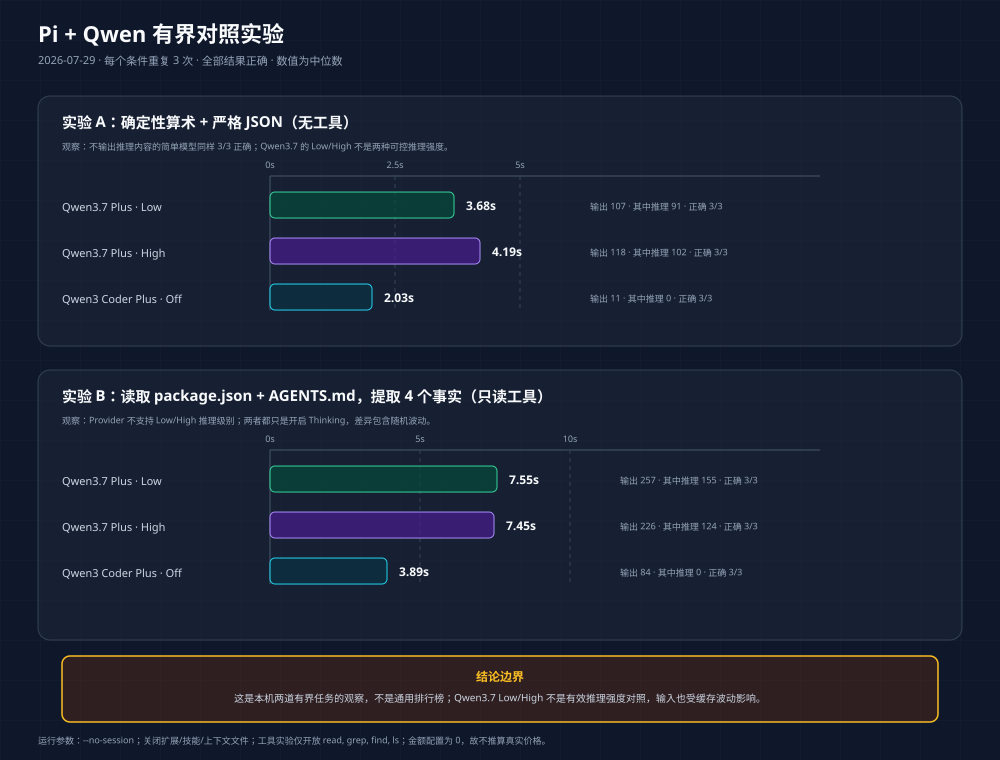

# Pi Agent + 模型高效使用手册

> 目标：用真实 Session、Pi 0.82.1 源码和可复现实验，解释如何控制上下文、模型、Thinking、工具、验证与成本。
>
> 配套阅读：[Codex Session 与模型高效使用手册](./codex-session-model-usage.zh-CN.md)

## 0. 先记住六条结论

1. **一个项目不是一个 Session。** 一个 Session 只服务于一个可以清晰验收的连续结果。
2. **累计 Token 不是当前上下文。** 当前上下文决定窗口压力；累计处理量决定长期重复开销。
3. **缓存不是免费，也不释放窗口。** 它降低重复前缀的处理价格或延迟，但长上下文仍会被每个工具循环重复携带。
4. **Pi 自动 Compact 是接近硬上限时的安全网，不是性能优化器。** 应在 50%–70% 主动做检查点、Compact 或换 Session。
5. **Thinking 是模型特定能力。** UI 显示 `low/high/off`，不等于 provider 一定支持对应的推理预算。
6. **先判断慢在模型还是工具。** 5 分钟的测试进程不能算成“模型思考了 5 分钟”。


## 阅读前先懂两个概念

### 什么叫“一个可验收结果”

它指这次 Session 最终要交付、并且能判断是否完成的一件事：

```text
可验收结果 = 明确交付物 + 完成标准 + 工作边界
```

例如，“看看项目”“继续完成”“部署吧”都不是完整的可验收结果，因为它们没有说清交付什么、怎样算完成。

更好的表达：

| 模糊说法 | 改成可验收结果 |
|---|---|
| 看看这个项目 | 输出架构概览、模块职责和关键入口，并引用源码文件 |
| 继续完成 | 继续修复 PWA 401；A/B 已完成，从 C 恢复；通过认证测试后停止 |
| 部署吧 | 把已验证版本部署到指定环境，健康检查通过，并准备回滚命令 |

调查、修改、定向测试和总结可以是同一个可验收结果的不同步骤，因此不需要“一条 Prompt 一个 Session”。但从“修复”切换到“部署”，或从“实现”切换到“写教程”，交付物和完成标准已经改变，通常应该新建 Session。

### Thinking 和当前上下文不是一回事

| 概念 | 大白话 |
|---|---|
| Thinking / 推理强度 | 这一轮允许模型投入多少推理深度 |
| 当前上下文 | 这一轮实际发给模型的需求、历史聊天、代码、日志和工具结果 |
| 上下文窗口 | 模型一次最多能接收多少材料 |

可以把它想成工程师在桌前工作：Thinking 是“让他快速判断还是认真推演”，当前上下文是“桌上摊了多少资料”。让工程师想得更深，不会自动收走桌上的旧资料；清理资料，也不会自动提高工程师的能力。

所以两者必须分别管理：

```text
任务很难、历史很短 → 可以提高 Thinking
任务很简单、历史很长 → 更应新建 Session，而不是继续提高 Thinking
任务不变、历史过长 → 形成检查点后 Compact
交付物已经变化     → 新建 Session
```

## 1. 审计快照与数据口径

本手册的案例不是想象。审计读取了：

- `~/.pi/agent/sessions/**/*.jsonl`；
- `~/.pi/agent/settings.json` 与 `models.json`，但不读取或展示密钥；
- 本机 `@earendil-works/pi-coding-agent` 0.82.1 的 Compaction 源码；
- 2026-07-29 运行的 Pi + Qwen 有界对照实验。

Session 快照范围为 2026-07-07 10:42 UTC 至 2026-07-29 06:56 UTC。

| 指标 | 数值 |
|---|---:|
| Session 文件 | 60 |
| JSONL records | 5,657 |
| `message` records | 5,432 |
| User message | 203 |
| Assistant / 模型调用 | 2,567 |
| Tool result | 2,662 |
| Compaction | 1 |
| 文件总大小 | 25.22 MiB |
| 文件中位数 / P90 | 12.27 KiB / 1.073 MiB |
| 最大文件 | 10.056 MiB |

Session 长度高度倾斜：

| Assistant 调用数 | Session 数 |
|---:|---:|
| 0–1 | 26 |
| 2–10 | 12 |
| 11–50 | 9 |
| 51–200 | 8 |
| >200 | 2 |

这说明平均数很容易掩盖问题：真正的大量 Token、时间和成本集中在极少数长 Session。

### 1.1 四个最容易混淆的数

| 数字 | 含义 | 用途 |
|---|---|---|
| `contextWindow` | 模型单次请求可容纳的上下文上限 | 判断硬容量 |
| 单次 `usage.totalTokens` | Pi 用来判断当前上下文压力的口径 | 判断是否接近 Compact |
| Session Token volume | 所有 Assistant 调用的 `totalTokens` 之和 | 判断重复处理量 |
| `usage.cost.total` | provider 当时写进 Session 的历史成本 | 只能统计有计价的调用 |

当前样本的累计处理量：

| Usage 字段 | 数值 |
|---|---:|
| `input` | 17,574,750 |
| `cacheRead` | 691,757,376 |
| `output` | 1,246,167 |
| `totalTokens` | **710,578,293** |
| `reasoning` | 316,666 |
| 缓存输入占 `input + cacheRead` | 97.52% |

正确关系是：

```text
totalTokens = input + cacheRead + output
reasoning 是 output 的子集，不能再加一次
```

710.6M 表示 2,567 次模型调用反复处理的累计 Token，不表示 Session 里有 710.6M 个唯一 Token，也不等于最终账单。

### 1.2 历史成本怎样解释

Session 自带的非零历史记录成本为：

| 成本分量 | 美元 |
|---|---:|
| Input | $8.3449 |
| Output | $10.3132 |
| Cache read | $178.9082 |
| 合计 | **$197.5664** |

全部非零记录来自历史 `kimi-coding/k3`。其他 provider 的成本字段为 0，只能解释成“Pi 本地没有计价”，不能说它们免费。

## 2. 一次 Pi 回合为什么会慢

```text
总耗时
= 模型预填与生成
+ 文件读取、搜索和命令执行
+ 测试、构建、下载、网络请求等长工具
+ 多轮「模型 → 工具 → 模型」循环
```

样本中的 2,565 次有效模型调用：

| 指标 | 模型响应耗时 |
|---|---:|
| 中位数 | 13.413 秒 |
| P90 | 35.296 秒 |
| 最大值 | 609.873 秒 |
| >60 秒 | 104 次 |
| >120 秒 | 28 次 |

工具没有完整独立计时字段，只能用父事件到 Tool Result 的间隔近似；并行工具会令这个数失真：

| 指标 | 工具父事件间隔 |
|---|---:|
| 中位数 | 0.036 秒 |
| P90 | 10.198 秒 |
| 最大值 | 952.066 秒 |
| >60 秒 | 133 次 |
| >300 秒 | 27 次 |

因此，页面显示“运行中”时先问：

1. 现在是在等待模型，还是等待 Bash / 测试 / 网络？
2. 当前是第几次模型—工具循环？
3. 工具是否在输出巨量日志？
4. 是否已经有足够证据停止，而 Agent 仍在扩大验证范围？

## 3. Session 是工作集，不是历史仓库

### 3.1 一个 Session 的正确边界

适合留在当前 Session：

- 仍在解决同一个 Bug；
- 实现和定向验证属于同一个验收结果；
- 新消息只是补充当前任务的事实或纠正；
- 当前历史的大部分仍会影响下一步判断。

适合新建 Session：

- 从架构调研进入独立代码实现；
- 从实现进入发布、运营或另一个平台；
- 目标、仓库、交付物或风险级别变化；
- 完成一个明确里程碑后开始下一阶段；
- 需要切换 provider / 模型，且历史已经很长；
- 当前历史的大部分与新问题无关。

新 Session 不等于丢背景。带一份短交接即可：

```text
目标与当前阶段：
已修改：
已验证：
未验证：
关键事实与文件：
下一阶段：
允许 / 禁止操作：
```

### 3.2 主动操作线

| 当前上下文占用 | 建议 |
|---:|---|
| `<50%` | 正常继续，但继续限制文件、日志和验证范围 |
| `50%–70%` | 准备检查点；完成当前小步后 Compact 或换 Session |
| `>70%` | 优先 Compact 或新建 Session，不再追加全量日志和大文件 |
| 接近硬上限 | 只做收口和交接，不再扩大任务 |

这些百分比是本手册的保守工程操作线，不是 Pi 或模型厂商的硬限制。

## 4. Pi 0.82.1 的 Compact 正确理论

本机当前未在 `settings.json` 覆写 Compaction，因此使用源码默认值：

```text
enabled = true
reserveTokens = 16,384
keepRecentTokens = 20,000

自动触发条件：
contextTokens > contextWindow - reserveTokens
```

不同窗口的默认自动触发线：

| 模型窗口 | 默认自动 Compact 阈值 |
|---:|---:|
| 262,144 | >245,760，约 93.75% |
| 1,000,000 | >983,616，约 98.36% |
| 1,048,576 | >1,032,192，约 98.44% |

这解释了为什么 70%–86% 的长 Session 仍不会自动 Compact：自动机制主要防溢出，不负责替你优化交互效率。

Compact 的过程是：

1. 从最近消息向前保留约 20K Token；
2. 用模型把更老历史总结为结构化摘要；
3. 写入 `compaction` entry；
4. 后续请求发送摘要 + 最近消息，而不是全部旧消息。

Compact 是有损的，也需要一次模型调用。完整 JSONL 历史仍在，但细节不会继续全部进入模型。应先形成检查点，再 Compact；不要在工具执行中途压缩。

唯一有 Compact 的历史 Session `019f476e…`：

```text
Compact 前：253,692 Token
下一次调用：22,531 Token
缩减：91.12%
```

JSONL 没记录这次是手动、阈值还是溢出触发，所以不能猜。

实现依据：[Pi Compaction 文档与源码](https://github.com/earendil-works/pi-mono/blob/main/packages/coding-agent/docs/compaction.md)。

## 5. 模型与 Thinking：先选能力，再选推理深度

### 5.1 当前本机模型角色

| 模型 | 本机窗口 | Thinking | 建议角色 |
|---|---:|---|---|
| `kimi6603/k3-256k` | 262,144 | 支持 | 日常复杂开发；当前默认 |
| `kimi6603/k3` | 1,048,576 | 支持 | 确实需要超长上下文的大任务 |
| `dashscope-coding/qwen3.7-plus` | 1,000,000 | 支持 Thinking 开关，但不支持 Low/High 等推理强度级别 | 复杂只读分析、编码与大上下文任务 |
| `dashscope-coding/qwen3-coder-plus` | 1,000,000 | 不支持 | 边界明确、重复、机械的编码任务 |
| `kimi-for-coding-highspeed` | 262,144 | 支持 | 输出速度优先且接受额度消耗 |

本机目录中的价格 0 是本地占位，不是官方价格。

### 5.2 Thinking 使用分布暴露的问题

| Thinking | 调用 | 占比 |
|---|---:|---:|
| high | 1,729 | 67.35% |
| off | 835 | 32.53% |
| low | 3 | 0.12% |

实际几乎只有 `high/off` 两档，没有形成“简单任务 low、复杂任务 high”的分层习惯。

推荐：

| 难度 | Thinking | 示例 |
|---|---|---|
| 清晰、机械 | off / low | 找文件、查进程、提取字段、格式转换 |
| 日常多步 | medium | 常规跨文件实现、定向调试 |
| 复杂高价值 | high | 架构审查、复杂故障、跨模块权衡 |
| 极难单点 | xhigh / max | 关键反证、最难设计节点；必须有理由 |

注意：`qwen3.7-plus` 当前配置的 `supportsReasoningEffort: false`，意思是 provider 不支持把推理深度细分成 Low、Medium、High 等级。Pi 中选 `low` 或 `high` 都只会开启 Thinking，不能证明 provider 收到了两种不同预算。样本中 457 次 Qwen3.7 调用都显示 Pi 状态 `off`，但 449 次仍产生 Thinking 内容；不要把 UI 状态直接等同于模型内部行为。

### 5.3 长 Session 中途切模型

模型切换会让旧模型建立的 Prompt Cache 失效。正确流程：

1. 让原模型完成当前检查点；
2. 输出短交接；
3. 新 Session 从目标模型开始；
4. 只带必要事实，不复制整段日志。

## 6. Pi + Qwen 可复现实验



实验控制：

- 同一 cwd、相同 Prompt、相同工具；
- 每个条件新建 `--no-session` 调用；
- 关闭技能、扩展和自动上下文文件；
- 工具实验只开放 `read,grep,find,ls`；
- 每个条件重复 3 次，报告中位数和正确率。

| 任务 | 模型 / 状态 | 中位耗时 | 中位 output | 中位 reasoning | 正确率 |
|---|---|---:|---:|---:|---:|
| 算术 + JSON | Qwen3.7 Plus / Low | 3.68s | 107 | 91 | 3/3 |
| 算术 + JSON | Qwen3.7 Plus / High | 4.19s | 118 | 102 | 3/3 |
| 算术 + JSON | Qwen3 Coder Plus / Off | **2.03s** | **11** | 0 | 3/3 |
| 只读提取 4 个仓库事实 | Qwen3.7 Plus / Low | 7.55s | 257 | 155 | 3/3 |
| 只读提取 4 个仓库事实 | Qwen3.7 Plus / High | 7.45s | 226 | 124 | 3/3 |
| 只读提取 4 个仓库事实 | Qwen3 Coder Plus / Off | **3.89s** | **84** | 0 | 3/3 |

正确解读：

1. 两道清晰任务里，非 reasoning 模型同样全部正确，且更快、更短；这支持“机械任务先用简单模型”。
2. Qwen3.7 的 Low / High 不是有效的推理强度对照，只能观察随机波动。
3. 输入 Token 受 provider 热缓存影响，没有用于横向结论。
4. 这不是通用模型排行榜；复杂任务必须另做有测试答案的基准。

## 7. 给 Agent 一份执行合同

高质量请求至少包含：

- 目标与期望产物；
- 允许修改的范围；
- 禁止触碰的内容；
- 只调查、等待审核，还是允许实施；
- Done when；
- 验证预算；
- 哪些外部操作必须暂停确认。

只读调研模板：

```text
只读调查，不修改文件、不创建或轮换 Key、不部署。
目标：列出可选模型、参数、证据来源和未验证项。
只读取官方文档和现有非敏感配置；不要输出任何密钥。
完成后停下，等我确认再实施。
```

实现模板：

```text
实现 <单一结果>，范围限于 <目录/文件>。
不要触碰 <禁区>，不要提交或部署。
先跑最小定向验证；只有定向验证通过后才考虑更大测试。
Done when：<行为> + <测试> + <文档/交接>。
```

网络中断后的续跑模板：

```text
继续完成 <单一结果>。
已完成：A、B；从 C 恢复；只做 D、E。
先检查 git status、diff 和最后工具结果，不重复已完成工作。
通过 X、Y 验收后停止并汇报；不要自动扩大测试范围。
```

## 8. 工具与验证分层

```text
格式 / 配置解析
→ 静态检查
→ 相关单元测试
→ 相关集成测试
→ 全量测试
→ 构建 / 端到端 / 部署验证
```

规则：

1. 调研阶段不默认运行全量测试。
2. 局部修改先跑能直接证明它的测试。
3. 全量测试放在交付收尾，并提前说明预计耗时。
4. 长工具运行时必须说明“正在跑什么”。
5. 工具失败、超时或取消必须保留真实状态。
6. 命令只返回必要摘要、错误尾部和产物路径；不要把 MB 级日志灌入上下文。

## 9. 真实案例分析

以下每个案例都把“JSONL 事实”和“改进推导”分开。Session ID 用于复核；不复制完整 Prompt、账号、密码或 Token。

### 案例 A：900K 长 Session，缓存也挡不住累计成本

Session：`019f9ef4-0000-7000-8000-000000000001`

| 指标 | 数值 |
|---|---:|
| Records | 2,048 |
| User message | 33 |
| 模型调用 / Tool result | 1,010 / 1,001 |
| 模型 | `kimi-coding/k3 + high` |
| Compaction | 0 |
| 峰值上下文 | 900,773 / 1,048,576 = **85.90%** |
| ≥50% / ≥70% / ≥85% 调用 | 608 / 230 / 10 |
| Token volume | **566,513,323** |
| Cache read | 564,999,680 |
| 缓存输入占比 | 99.82% |
| 记录成本 | **$179.8783** |

事实：单个 Session 占全部样本记录成本的 91.05%；其中 $169.4999，即 94.23%，来自 Cache Read。它连续进行了大量审查、修改与验证，但一直没有 Compact。

推导：缓存单价可能较低，但 1,010 个循环每次都携带长上下文，累计仍会很贵。每个独立审查或实现里程碑通过后，应形成检查点并 Compact；进入新的可验收结果时新建 Session。

为什么没有自动 Compact？85.90% 仍低于 1M K3 的默认自动触发线 98.44%。这正说明自动机制不能代替主动管理。

### 案例 B：一个 Session 混入多个项目、部署与调研

Session：`019f476e-6f75-752a-b098-a976dd58340f`

匿名化任务跨度包括：文档/架构、硬件项目查找、克隆仓库、本机和远程部署、网络代理、模型配置以及另一个产品部署。

| 指标 | 数值 |
|---|---:|
| 时间跨度 | 63.18 小时 |
| User message | 41 |
| 模型调用 / Tool result | 417 / 376 |
| 实际模型切换 | 4 次 |
| Compaction | 1 |
| Token volume | 51,559,106 |
| Tool error result | 53 |
| Aborted 模型调用 | 8 |

三次跨 provider 切换后的首轮均为 0 Cache Read：

| 切换 | 首轮 input | cacheRead | totalTokens |
|---|---:|---:|---:|
| Qwen → GLM | 150,363 | 0 | 150,593 |
| GLM → Qwen | 194,102 | 0 | 194,553 |
| Qwen → GLM | 205,601 | 0 | 205,718 |

事实：唯一一次 Compact 把下一轮从 253,692 降至 22,531，缩减 91.12%；多次 300–900 秒等待来自网络/Bash 工具。

推导：每个产品、部署环境和模型配置都应独立成 Session。必须切 provider 时先形成交接；用户看到“运行中”也应区分工具等待与模型生成。

### 案例 C：18.7 万 Token Session，中途换成更小窗口

Session：`019faca8-c24a-7743-992f-cde87696eed9`

旧文把不同截点的数据混在一起。当前统一快照：

| 指标 | 旧表 | 当前快照 |
|---|---:|---:|
| Records | 175 | 187 |
| 模型调用 | 73 | 79 |
| Tool result | 89 | 94 |
| User message | 7 | 8 |

模型切换证据：

```text
切换前最后一次 k3：
input 522 + cacheRead 181,760 + output 92 = 182,374

切换后第一次 k3-256k：
input 181,652 + cacheRead 768 + output 170 = 182,590
```

换成 256K 模型后，首轮立刻占：

```text
182,590 / 262,144 = 69.65%
```

当前峰值：

```text
187,087 / 262,144 = 71.37%
```

事实：原上下文在 1M K3 里只占约 17%，切到 256K 后突然接近 70%，并且首次只有 768 Cache Read，需要重新预填约 181K。旧截点的模型调用耗时中位数 22.1 秒、P90 75.436 秒、最大 173.652 秒。

随后运行全量测试时，主要等待来自工具。用户停止后记录为 `Command aborted`，Assistant 以 `aborted` 结束，没有伪造成功。恢复后先检查状态，再完成定向验证，最终明确记录 `79 passed in 353.86s`。

推导：不要在长 Session 中途换成明显更小窗口；先交接再新开。停止后检查现场、不盲目重跑，是这个案例里做对的部分。

### 案例 D：在 213K 上下文里切 Qwen，首轮重新预填

Session：`019fa2f4-c493-7108-9c72-3c9da38db575`

该 Session 从项目调研进入安装、插件设计、实现和 UI 改进，之后用一句“继续完成”切到 Qwen。

| 字段 | 切换后首轮 |
|---|---:|
| input | 213,338 |
| cacheRead | 0 |
| output | 11,580 |
| reasoning | 4,160 |
| totalTokens | 224,918 |
| 模型响应时间 | 217.36 秒 |

事实：更换模型后整段上下文重新预填，且本轮输出很长。

推导：“换个模型继续”不是轻量操作。先让原模型输出实现检查点，再用新 Session 给 Qwen 一份短交接。

### 案例 E：Qwen 适合边界清晰的只读诊断

Session：`019fab35-5b79-7ff1-830f-b5ccd09c3d8c`

任务是确认本地服务由谁启动，并解释 Pi Web 新建 Session 的调用链。

| 指标 | 数值 |
|---|---:|
| User message | 2 |
| 模型调用 / Tool result | 13 / 20 |
| Token volume | 131,306 |
| 峰值 totalTokens | 21,999 |
| 模型响应中位数 / P90 | 4.9 秒 / 8.1 秒 |
| Assistant error / abort | 0 |

事实：任务边界清晰、只读、结果可核对，Qwen 完成稳定。

推导：这能证明它适合此类任务，但不是与 K3 的同题基准，不能据此宣称总体质量更优。

### 案例 F：把凭据直接粘进 Session

Session `019f9710-5326-7e5b-b271-e8eb78304fcb` 有 2 条 User message 命中明文凭据模式。具体值绝不能复制到文档。

风险：

1. 凭据永久进入本地 JSONL；
2. 后续请求、缓存、Compact 摘要或 HTML 导出可能继续传播；
3. 删除聊天显示不等于轮换已暴露凭据。

正确做法：

- 通过环境变量、受限配置文件或 Pi Web 专用认证界面保存；
- Prompt 只给 provider 名和配置位置，不给值；
- Agent 只能报告“存在/缺失”，不能回显；
- 已粘贴过的 Key、密码或 Token 应轮换。

## 10. 停止 Agent 后如何恢复

| 最后状态 | 含义 | 恢复方法 |
|---|---|---|
| Assistant 正常结束 | 本轮已收口 | 提出下一任务 |
| 工具已返回，Assistant 未总结 | 结果存在但未收口 | 读取现有结果并总结，不重跑 |
| 工具显示 `Command aborted` | 工具被取消，没有验证结论 | 检查工作区，再跑最小必要验证 |

恢复 Prompt：

```text
刚才运行被停止。不要重复已完成的修改，也不要自动重跑全量测试。
先检查 git status、diff 和最后一条工具结果，列出：
1. 已完成；2. 未完成；3. 被取消的验证；4. 最小必要验证。
然后只执行与本次改动直接相关的定向测试。
如果仍需全量测试，先说明原因和预计耗时，等我确认。
```

## 11. 开始、执行、结束检查表

开始前：

- 这还是当前可验收结果，还是已经换了交付物或完成标准？
- 模型窗口能否覆盖预计工作集？
- 是否应从简单模型 / low 开始？
- 是否写清修改权限、禁区、Done when 和验证预算？
- Prompt 是否含凭据？如有，停止并改用安全配置。

执行中：

- 当前等待模型还是工具？
- `totalTokens / contextWindow` 到了多少？
- 是否反复读取同一大文件、长日志或测试输出？
- 是否切模型导致 Cache Read 归零？
- 当前验证是否已经足够证明结果？

结束时：

- 修改、验证、风险和未完成项是否分开列出？
- 工具取消或超时是否如实记录？
- 是否形成下一 Session 的短交接？
- 下一阶段是否仍属于当前工作集？

## 12. 如何做可信的模型实验

不要拿两个不同任务的耗时直接排名。至少控制：

```text
相同 cwd + 相同 Prompt + 相同工具 + 相同权限
每个模型使用新 Session
冷启动与热缓存分开
每个条件至少重复 3 次
记录正确率、模型时间、工具时间、调用数、totalTokens 和已记录成本
```

实验先选有客观答案的任务，例如：

- 从同一组文件提取固定事实；
- 修复带确定失败测试的小 Bug；
- 对同一 Diff 找已知注入缺陷；
- 按相同 Schema 输出结构化结果。

## 13. 数据限制与复核方法

- Assistant 外层时间差是模型响应耗时近似，不是服务端精确 TTFT/生成耗时。
- 工具父事件间隔会受并行调用影响，不能当精确工具时长。
- `isError=true` 可能是预期负向验证，不能直接算 Agent 失败。
- 历史成本只覆盖当时写入非零价格的 provider。
- Session 会继续增长；引用案例必须带快照时间或记录数。

复核单个 Pi Session：

```bash
jq -c 'select(.type == "message" and .message.role == "assistant") |
  {timestamp, provider: .message.provider, model: .message.model,
   usage: .message.usage, stopReason: .message.stopReason}' SESSION.jsonl

jq -c 'select(.type == "compaction") |
  {timestamp, tokensBefore, firstKeptEntryId}' SESSION.jsonl
```

一句话原则：**为可验收结果选择 Session，为 Session 固定模型，为阶段控制上下文，为难度选择 Thinking，为风险分层验证。**
